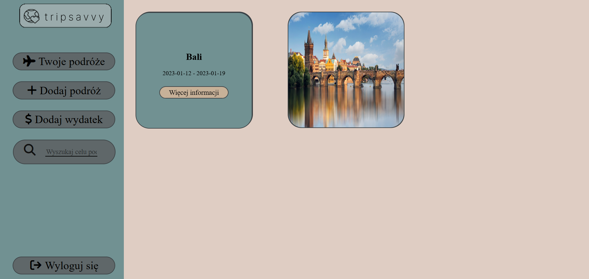
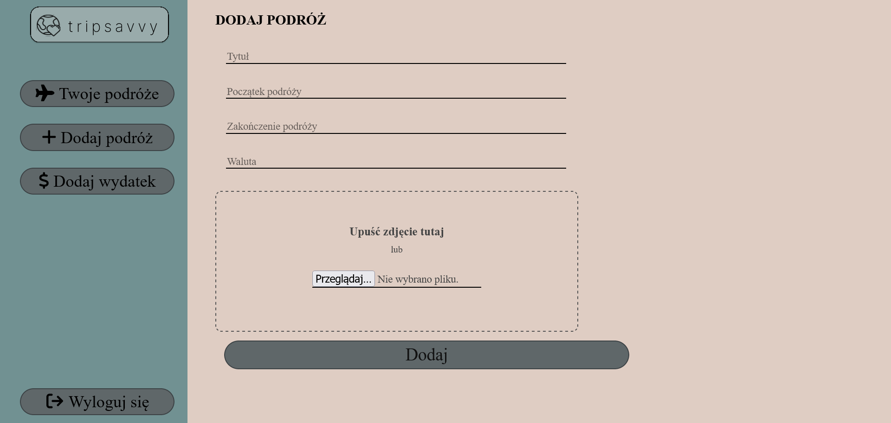
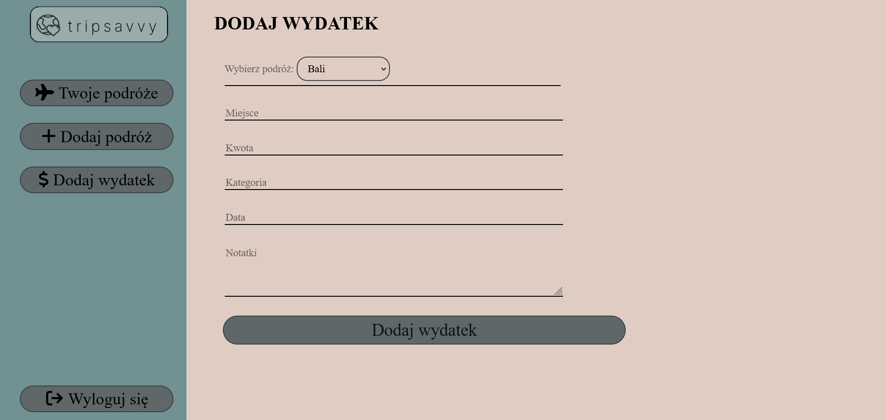
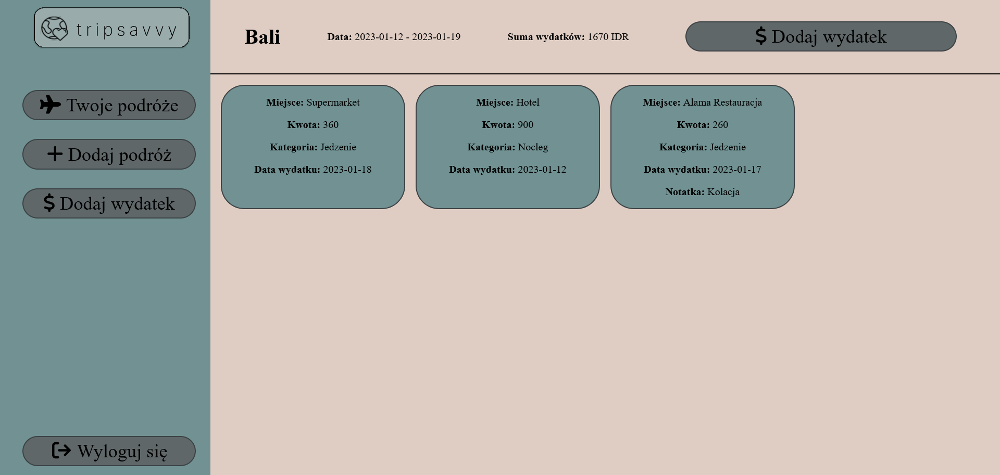

# Tripsavvy

> Website to note down your trips and travels expenses.
> Available version for mobile devices.

## Table of contents

* [General Information](#general-information)
* [Technologies Used](#technologies-used)
* [Features](#features)
* [Screenshots](#screenshots)
* [Launch](#launch)
* [Project Status](#project-status)

## General Information

This application will help you to save information about your travels and expenses during them.
You will be able to save important dates, amount of spent money or notes about expenses.

## Technologies Used

- HTML5
- CSS3
- JavaScript
- PHP 8.1
- PostgreSQL
- Docker
- Git

## Features

- The user can login in his/her account or create new one.
- The user have a preview for all trips and can choose one for read more about its expenses.
- The user have a preview for all expenses associated with specifi travel and sum of them in selected currency.
- The user can add new trip with details like title, date of beginning, date of end, currency, image from trip.
- The user can add expense associated with specific travel with details like place, amount of expense, category, date, extra notes.

## Screenshots

## Launch

To launch this project you need to open Docker Application, then open the terminal in main directory of the project. Type `docker-compose up` in the terminal and then open your browser. Type `localhost:8080` in the address bar to enjoy the application.

## Project Status

The project is _complete_ for the basic usage.
